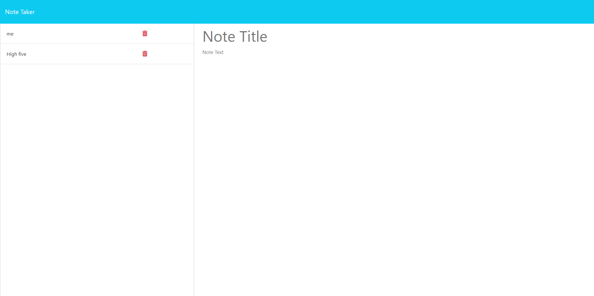

# WeekElevenChallenge_NoteTaker

## Description

I created this project to help me take notes and keep track of the notes. I built this application to understand more of how express works and can help me create APIs for my own projects. This solves the problem of organizing notes and storeing the notes. I learned from creating this application how inportant it is to be able to create our own APIs.

  

  Link to applictaion on Heroku()